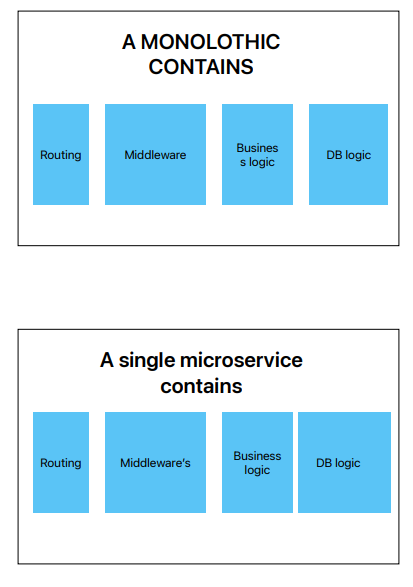

# What is Micoservice?

- so micro service is broken down large application into a number of small independent
 services that can communicate each other a network .
- this services can be created , deployed and scaled indpendtly.
- each service carry particular business activity and intract with other micro service
  via clear api.

# Diffrence between monolothic vs microservice?
###  Single Unit:
- A monolithic application is built as a single unit. It contains all the routing, middleware, business logic, and database access within a single codebase.
### Decoupled Services:
- In microservices architecture, the application is divided into smaller, independent services. Each service handles a specific piece of business functionality.
###  Scaling:
- To scale a monolithic application, you usually need to run multiple instances of the entire application. This approach creates additional instances of the whole application, even if only one part needs scaling. In contrast, in microservices architecture, you can scale individual services independently, which is more efficient.
###  Independent Scaling:
- Each microservice can be scaled independently based on its demand. This means you can scale only the services that need it, rather than the entire application.
###  Failure Impact:
- In a monolithic application, a failure in one part of the application can potentially bring down the entire application. This is because all components are tightly coupled.
-  A failure in one microservice does not necessarily impact the others. This containment reduces the risk of a single point of failure affecting the entire system.
### Deployment:
- In a monolithic architecture, all components are deployed together. This means any change, even a small one, requires redeploying the entire application.
-  Microservices can be deployed independently. You can update or deploy one service without needing to redeploy the entire application.

<!-- 
# JavaScript Primitive Data Types

## Overview

In JavaScript, data types are classified into primitive and non-primitive types. This README focuses on *primitive data types*, which are the basic building blocks in JavaScript. Primitive data types represent single values and are immutable, meaning their values cannot be changed once created.

## Primitive Data Types

### 1. String
*Description*: Represents a sequence of characters used to store and manipulate text. 
- *Examples*: 
  - "Hello, world!"
  - 'JavaScript'
  - `` Template literal ``

### 2. Number
*Description*: Represents both integer and floating-point numbers. It includes standard numeric values.
- *Examples*: 
  - 42
  - 3.14

### 3. BigInt
*Description*: Represents integers with arbitrary precision. It allows for the representation of very large integers beyond the range of the Number type.
- *Examples*: 
  - 9007199254740991n

### 4. Boolean
*Description*: Represents a logical value that can be either true or false. Often used in conditional statements and loops.
- *Examples*: 
  - true
  - false

### 5. Undefined
*Description*: Represents a variable that has been declared but has not yet been assigned a value. It signifies the absence of a value.
- *Examples*: 
  - let x; // x is undefined

### 6. Null
*Description*: Represents the intentional absence of any object value. It is used to denote a deliberate non-value or empty value.
- *Examples*: 
  - let y = null;

### 7. Symbol
*Description*: Represents a unique and immutable value often used as a key for object properties, ensuring that property keys are unique.
- *Examples*: 
  - Symbol('description')

## Characteristics of Primitive Data Types

- *Immutability*: Primitive values cannot be altered once they are created. For example, modifying a string results in the creation of a new string rather than changing the original one.
- *Pass by Value*: When a primitive value is assigned to a variable or passed to a function, a copy of the value is made. Changes to the variable or parameter do not affect the original value.
- *Simple Representation*: Primitive types represent a single value, unlike non-primitive types which can hold collections or more complex structures.

## Additional Resources

- [JavaScript Data Types - MDN Web Docs](https://developer.mozilla.org/en-US/docs/Web/JavaScript/Data_structures)
- [Understanding JavaScript Primitive Types](https://www.javascripttutorial.net/javascript-primitive-data-types/) -->